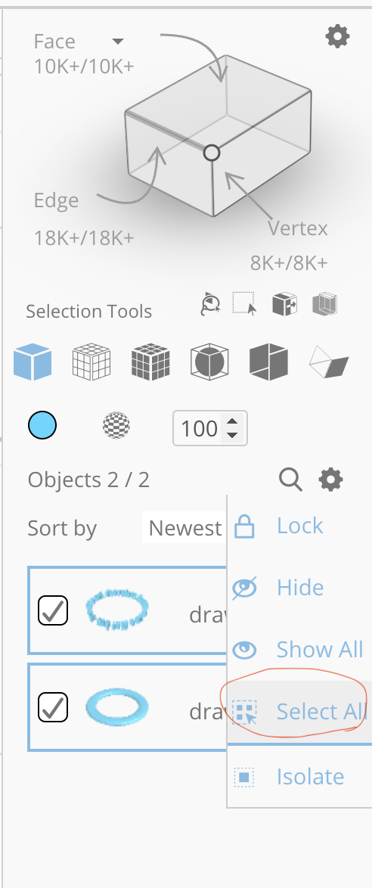

We provide 3D printers for falculty, researchers, and students who need to prototype their 3D models. To use these 3D printers, 
you only need to provide the G-code of the model you would like to print. You can copy the G-code to a MicroSD card and plug 
the MicroSD card into one of out 3D printers. Our maker space has a few MicroSD cards you can use while you are here.  

You can use any 3D modeling software to create your models. In this tutorial, we will use SelfCAD Cloud Service to make a model 
and slice it to generate the G-code. Then we will download the G-code and print it with one of our 3D printers.

1. Create an account at https://selfcad.com.
2. Log in to your account. Select 'Product' -> 'Online 3D CAD', and then on the 3D CAD page, click 'Launch Editor'.  
3. On the SelfCAD's editor page, click 'New Project'. 
4. Create a model using the tools provided on the top panel where tools such as 3D shapes, Generators, Drawing are located. 
The following youtube video can get you started.

5. Once you are done with the model, select all the parts of the model from the right panel. Click 'Stich & Scoop', and then 
click 'Union'. If there are too many parts in your model, you can click the gear icon and then click 'Select All'.

6. Now click '3D Print' on the tools panel. A new page will be opened in a new tab for 3D printing setup.
7. In the 3D printing setup page, select the 3D printer 'Creality Ender-3/Ender-3 v2', 0.4mm nozzle, and PLA for material. 
8. Click 'Slice' on the top center of the cube. 
9. When the slicing is done, a button 'Save G Code' will appear on the right bottom of the 3D priting page. Click the button to save the G-code to your computer.

